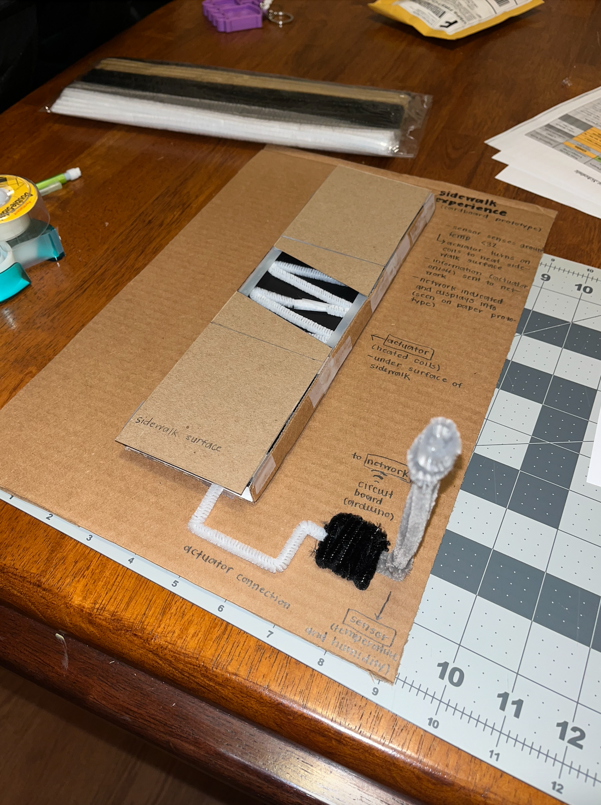
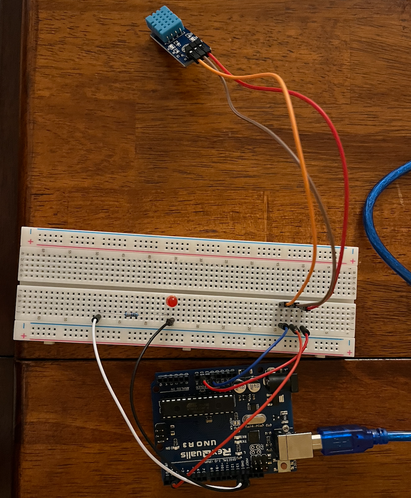

# Heated-Sidewalk
Arduino that demonstrates how a heated sidewalk would function. The solution must implement a Sensor, Actuator, and Network. The temperature and humidity is the sensor, the actuator is the heated sidewalk (here it is demonstrated as the LED), and the network is the app wireframes that we created.

